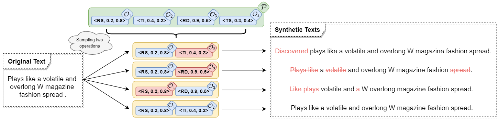

# Text-AutoAugment (TAA)
This repository contains the code for our paper [Text AutoAugment: Learning Compositional Augmentation Policy for Text Classification](https://arxiv.org/abs/2109.00523) (EMNLP 2021 main conference).



# Updates
- [22.02.23]: We add an example on how to use TAA for your **custom (local) dataset**.
- [21.10.27]: We make taa installable as a package and adapt to [huggingface/transformers](https://github.com/huggingface/transformers). 
Now you can search augmentation policy for the **huggingface dataset** with **TWO** lines of code.

# Quick Links
- [Overview](#overview)
- [Getting Started](#getting-started)
  * [Prepare environment](#prepare-environment)
  * [Use TAA with Huggingface](#use-taa-with-huggingface)
    + [1. Get augmented training dataset with TAA policy](#1-get-augmented-training-dataset-with-taa-policy)
    + [2. Fine-tune a new model on the augmented training dataset](#2-fine-tune-a-new-model-on-the-augmented-training-dataset)
  * [Reproduce results in the paper](#reproduce-results-in-the-paper)
- [Contact](#contact)
- [Acknowledgments](#acknowledgments)
- [Citation](#citation)
- [License](#license)

# Overview
1. We  present  a  learnable  and  compositional framework for data augmentation.  Our proposed algorithm automatically searches for the optimal compositional policy, which improves the diversity and quality of augmented samples.

2. In low-resource and class-imbalanced regimes of six benchmark datasets, TAA significantly improves the generalization ability of deep neural networks like  BERT and effectively boosts text classification performance.

# Getting Started

## Prepare environment

Install pytorch and other small additional dependencies. Then, install this repo as a python package. Note that `cudatoolkit=10.2` should match the CUDA version on your machine.

```bash
# Clone this repo
git clone https://github.com/lancopku/text-autoaugment.git
cd text-autoaugment

# Create a conda environment
conda create -n taa python=3.6
conda activate taa

# Install dependencies
pip install torch==1.10.1+cu102 -f https://download.pytorch.org/whl/cu102/torch_stable.html
pip install git+https://github.com/wbaek/theconf
pip install git+https://github.com/ildoonet/pystopwatch2.git
pip install -r requirements.txt

# Install this library (**no need to re-build if the source code is modified**)
python setup.py develop

# Download the models in NLTK
python -c "import nltk; nltk.download('wordnet'); nltk.download('averaged_perceptron_tagger'); nltk.download('omw-1.4')"
```
Please make sure your Torch supports GPU, check it with the command `python -c "import torch; print(torch.cuda.is_available())"` (should output `True`).

## Use TAA with Huggingface

### 1. Get augmented training dataset with TAA policy

<details>
<summary><b>Option 1: Search for the optimal policy</b></summary>

You can search for the optimal policy on classification datasets supported by [huggingface/datasets](https://huggingface.co/datasets):
```bash
from taa.search_and_augment import search_and_augment

# return the augmented train dataset in the form of torch.utils.data.Dataset
augmented_train_dataset = search_and_augment(configfile="/path/to/your/config.yaml")
```

The `configfile` (YAML file) contains all the arguments including path, model, dataset, optimization hyper-parameter, etc.
To successfully run the code, please carefully preset these arguments:
<details>
<summary>show details</summary>

- `model`:
  - `type`: *backbone model*
- `dataset`:
  - `path`: *Path or name of the dataset*
  - `name`: *Defining the name of the dataset configuration*
  - `data_dir`: *Defining the data_dir of the dataset configuration*
  - `data_files`: *Path(s) to source data file(s)*

  **ATTENTION**: All the augments above are used for the `load_dataset()` function in [huggingface/datasets](https://huggingface.co/datasets). Please refer to [link](https://huggingface.co/docs/datasets/v1.12.1/package_reference/loading_methods.html#datasets.load_dataset) for details. 
  - `text_key`: *Used to get text from a data instance (`dict` form in huggingface/datasets. See this [IMDB example](https://huggingface.co/datasets/imdb#data-instances).)*
- `abspath`: *Your working directory*
- `aug`: *Pre-searched policy*. Now we support **IMDB**, **SST5**, **TREC**, **YELP2** and **YELP5**. See [archive.py](taa/archive.py).
- `per_device_train_batch_size`: *Batch size per device for training*
- `per_device_eval_batch_size`: *Batch size per device for evaluation*
- `epoch`: *Training epoch*
- `lr`: *Learning rate*
- `max_seq_length`
- `n_aug`: *Augment each text sample n_aug times*
- `num_op`: *Number of operations per sub-policy*
- `num_policy`: *Number of sub-policy per policy*
- `method`: *Search method (taa)*
- `topN`: *Ensemble topN sub-policy to get final policy*
- `ir`: *Imbalance rate*
- `seed`: *Random seed*
- `trail`: *Trail under current random seed*
- `train`:
  - `npc`: *Number of examples per class in the training dataset*
- `valid`:
  - `npc`: *Number of examples per class in the val dataset*
- `test`:
  - `npc`: *Number of examples per class in the test dataset*
- `num_search`: *Number of optimization iteration*
- `num_gpus`: *Number of GPUs used in RAY*
- `num_cpus`: *Number of CPUs used in RAY*
</details>

#### `configfile` example 1: TAA for huggingface dataset
>[bert_sst2_example.yaml](taa/confs/bert_sst2_example.yaml) is a configfile example for BERT model and [SST2](https://huggingface.co/datasets/glue#sst2) dataset. 
You can follow this example to create your own configfile for other **huggingface dataset**. 
>
>For instance, if you only want to change the dataset from `sst2` to `imdb`, just delete the `sst2` in the `'path'` argument, modify the `'name'` to `imdb` and modity the `'text_key'` to `text`. The result should be like [bert_imdb_example.yaml](taa/confs/bert_imdb_example.yaml).

#### `configfile` example 2: TAA for custom (local) dataset

>[bert_custom_data_example.yaml](taa/confs/bert_custom_data_example.yaml) is a configfile example for BERT model and **custom (local) dataset**.
The custom dataset should be in the CSV format, and the column name of the data table should be `text` and `label`. [custom_data.csv](taa/data/custom_data_train.csv) is an example of the custom dataset.
>
>**WARNING**: The policy optimization framework is based on [ray](https://github.com/ray-project/ray). By default we use 4 GPUs and 40 CPUs for policy optimization. Make sure your computing resources meet this condition, or you will need to create a new configuration file. And please specify the gpus, e.g., `CUDA_VISIBLE_DEVICES=0,1,2,3` before using the above code. TPU does not seem to be supported now.   


</details>

<details>
<summary><b>Option 2: Use our pre-searched policy</b></summary>

To train a model on the datasets augmented by our pre-searched policy, please use (Take [IMDB](https://huggingface.co/datasets/imdb) as an example):
```bash
from taa.search_and_augment import augment_with_presearched_policy

# return the augmented train dataset in the form of torch.utils.data.Dataset
augmented_train_dataset = augment_with_presearched_policy(configfile="/path/to/your/config.yaml")
```

Now we support **IMDB**, **SST5**, **TREC**, **YELP2** and **YELP5**. See [archive.py](taa/archive.py) for details. 

This table lists the test accuracy (%) of pre-searched TAA policy on **full** datasets:

| Dataset |  IMDB | SST-5 |  TREC | YELP-2 | YELP-5 |
|---------|:-----:|:-----:|:-----:|:------:|:------:|
| No Aug  | 88.77 | 52.29 | 96.40 |  95.85 |  65.55 |
| TAA     | 89.37 | 52.55 | 97.07 |  96.04 |  65.73 |
| n_aug   |   4   |   4   |   4   |    2   |    2   |

More pre-searched policies and their performance will be **COMING SOON**. 
</details>

### 2. Fine-tune a new model on the augmented training dataset

After getting `augmented_train_dataset`, you can load it to the huggingface trainer directly. Please refer to [search_augment_train.py](taa/search_augment_train.py) for details. 

## Reproduce results in the paper

Please see [examples/reproduce_experiment.py](examples/reproduce_experiment.py), and run [script/huggingface_lowresource.sh](script/huggingface_lowresource.sh) or [script/huggingface_imbalanced.sh](script/huggingface_imbalanced.sh).

# Contact

If you have any questions related to the code or the paper, feel free to open an issue.

# Acknowledgments
Code refers to: [fast-autoaugment](https://github.com/kakaobrain/fast-autoaugment).

# Citation

If you find this code useful for your research, please consider citing:
```
@inproceedings{ren2021taa,
    title = "Text {A}uto{A}ugment: Learning Compositional Augmentation Policy for Text Classification",
    author = "Ren, Shuhuai and Zhang, Jinchao and Li, Lei and Sun, Xu and Zhou, Jie",
    booktitle = "Proceedings of the 2021 Conference on Empirical Methods in Natural Language Processing",
    year = "2021",
}
```

# License

MIT
